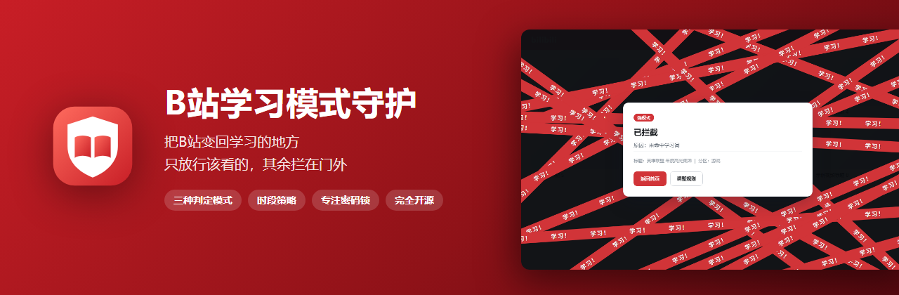
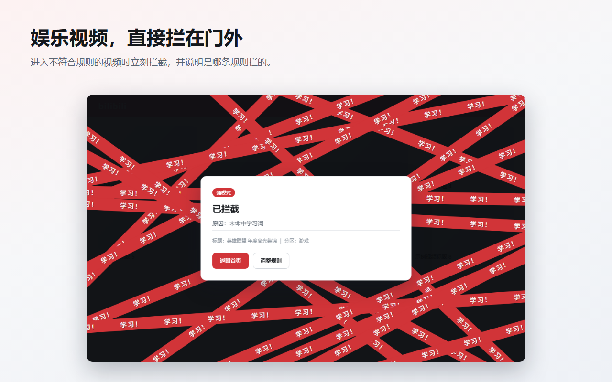
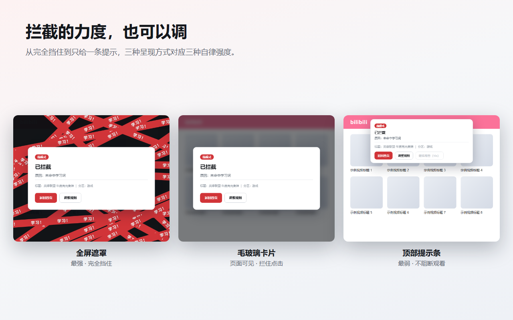
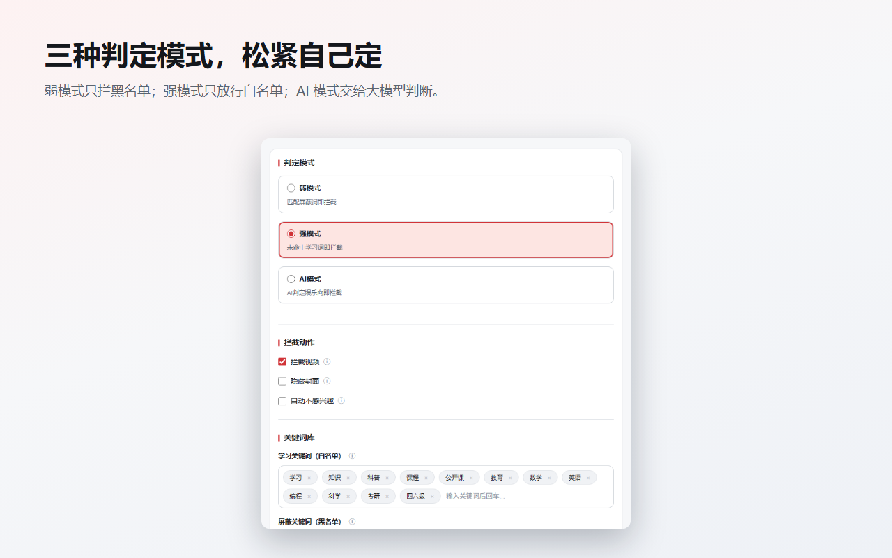
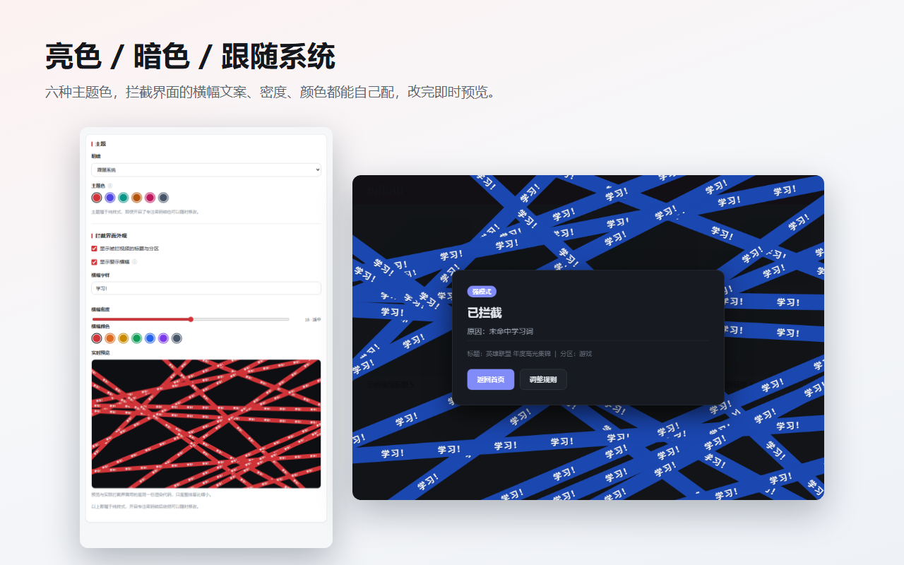
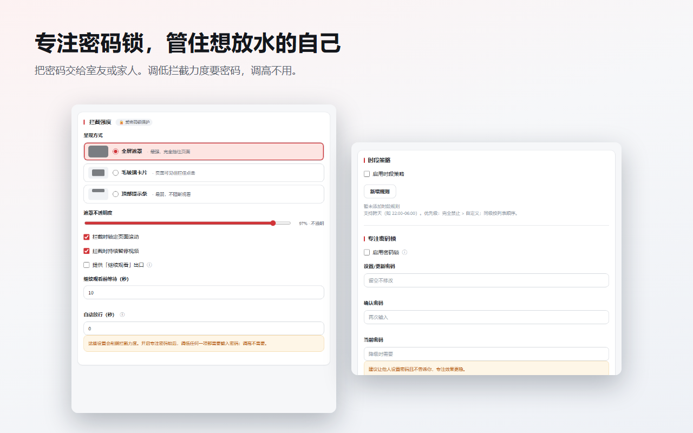
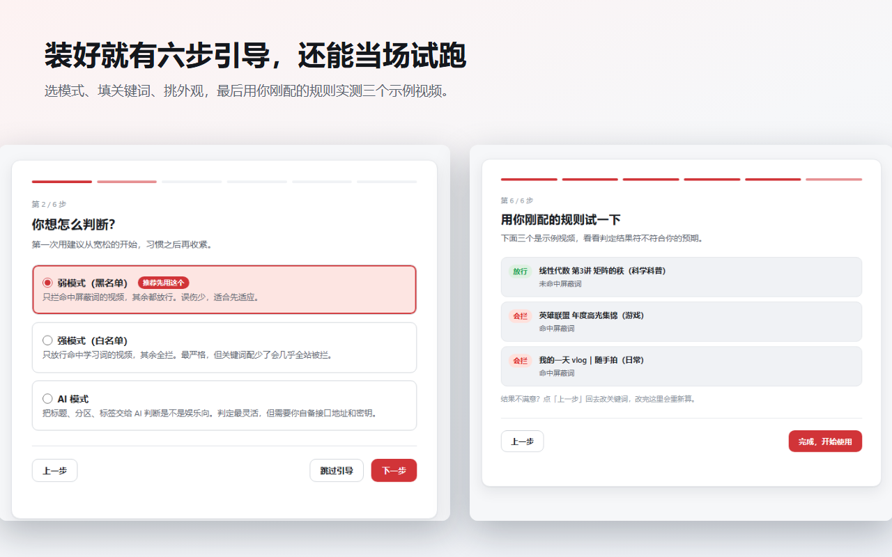

<div align="center">



**打开B站是为了找网课，两小时后你还在看鬼畜。**
这个插件帮你把那两小时拿回来。
[](https://microsoftedge.microsoft.com/addons/detail/jachmidhanilfknhankklemigokhpbkm)

</div>

---

## 它到底做什么

进入B站视频页的那一刻，扩展先取到这个视频的**标题、分区、标签、UP主**，按你定的规则判断该不该看。不该看的，直接拦下来，并告诉你是**哪条规则**拦的。

不是简单的网站屏蔽——B站上既有网课也有鬼畜，一刀切封掉整个域名等于把学习资源也封了。这个扩展做的是**逐个视频判定**。

<div align="center">

</div>

---

## 为什么它拦得住你

大多数专注类插件的问题是：**你自己随时能关掉**。

所以这里的设计重点不是拦得多狠，而是**让「放水」这件事变难**：

<table>
<tr>
<td width="50%" valign="top">

#### 🔒 密码锁只管强度，不管样式

换主题、换配色、改横幅文案 —— 随便改，不要密码。

把拦截力度调低（降级呈现方式、开放「继续观看」、把遮罩调淡）—— **要密码**。调高不用。

把密码交给室友或家人，你就绕不过自己。

</td>
<td width="50%" valign="top">

#### 🧱 强度比较不可"补偿"

拦截强度按 6 个独立维度逐一比较，**任一维变弱就要密码**。

刻意不合成加权总分 —— 否则你可以"把遮罩调到看不清、同时把某个无关维度调严"，总分持平就绕过去了。

</td>
</tr>
</table>

---

## 核心能力

| | 能力 | 说明 |
|:--:|---|---|
| 🎯 | **三种判定模式** | 弱（黑名单）/ 强（白名单）/ AI 判定，互斥切换 |
| 🚫 | **拦截视频** | 不符合规则的视频页直接拦下，说明拦截原因 |
| 🙈 | **隐藏封面** | 首页 / 推荐流 / 搜索结果里的娱乐卡片直接隐藏 |
| 👎 | **自动不感兴趣** | 对被判定为娱乐的视频自动执行「不感兴趣」 |
| 📺 | **直播拦截** | 直播间同样按规则判定 |
| ⏰ | **时段策略** | 按星期 + 时间段套用不同规则，支持跨天（22:00–06:00） |
| 🔐 | **专注密码锁** | 降低专注度的操作需要密码，提升不需要 |
| 🎨 | **主题与自定义** | 亮 / 暗 / 跟随系统，六种主题色，横幅可调 |
| 🧭 | **首装引导** | 六步配好，最后用你的规则**当场试跑**三个示例视频 |

---

## 拦截力度，你自己定

从"完全挡住"到"只给一条提示"，三档强度对应三种自律程度。

<div align="center">

</div>

---

## 安装

<table>
<tr>
<td width="50%" valign="top">

### 从商店安装（推荐）

[](https://microsoftedge.microsoft.com/addons/detail/jachmidhanilfknhankklemigokhpbkm)

装好会自动打开引导页，跟着走完就能用。

</td>
<td width="50%" valign="top">

### 本地加载（尝鲜 / 开发）

1. 下载本仓库并解压
2. 打开 `edge://extensions/`
3. 开启右下角**开发人员模式**
4. 点击**加载解压缩的扩展**，选择本目录

</td>
</tr>
</table>

> **浏览器要求：Edge / Chrome 123 及以上。**
> 样式令牌用了 CSS 的 `light-dark()`，它让亮暗主题只写一份、跟随系统时零 JS、零闪烁。

---

## 更多截图

<details>
<summary><b>点开看看：判定模式、主题、密码锁、引导流程</b></summary>
<br>

**三种判定模式**


**亮色 / 暗色 / 跟随系统，横幅可自定义**


**专注密码锁与时段策略**


**首装引导，最后一步实地试跑**


</details>

---

## 深入了解

<details>
<summary><b>三种判定模式怎么选</b></summary>
<br>

| 模式 | 逻辑 | 适合谁 |
|---|---|---|
| **弱模式**（黑名单） | 命中屏蔽词 → 拦截，其余放行 | 第一次用。误伤少，先适应 |
| **强模式**（白名单） | 未命中学习词 → 拦截 | 严格自律。**关键词配少了会几乎全站被拦** |
| **AI 模式** | 把标题/分区/标签交给 AI 判断 | 懒得维护关键词，且自备接口的人 |

判定用的文本包括：标题、分区名、标签、UP主名、UP主签名、视频简介。

> 强模式是默认值，但引导页会**预选弱模式**——新用户直接用白名单会几乎全站被拦，这是最大的首次体验陷阱。设置页在强模式下关键词少于 3 个时也会高亮警告。

</details>

<details>
<summary><b>三种拦截呈现方式的区别</b></summary>
<br>

| 方式 | 效果 | 滚动锁 | 警示横幅 | 强度 |
|---|---|:--:|:--:|:--:|
| **全屏遮罩**（默认） | 完全挡住页面 | 跟随设置 | 支持 | 最强 |
| **毛玻璃卡片** | 页面可见但拦住点击 | 跟随设置 | 否 | 中 |
| **顶部提示条** | 不阻断观看 | 强制关闭 | 否 | 最弱 |

顶部提示条隐含「允许继续观看」——提示条本来就不阻断，所以它在密码锁里的强度评级最低。**评级顺序与实际可绕过难度一致**，不存在"选了最弱的反而不要密码"的漏洞。

此外还可以配置：「继续观看」出口与等待秒数、倒计时自动放行、是否锁定滚动、是否持续暂停视频、遮罩不透明度。

</details>

<details>
<summary><b>时段策略</b></summary>
<br>

按星期 + 时间段套用不同规则：

- **完全禁止访问**：该时段内一律拦截，连学习视频也拦
- **自定义**：该时段内覆盖判定模式与拦截动作

支持跨天配置（如 `22:00–06:00`）。优先级：`完全禁止 > 自定义`，同级按列表顺序。

</details>

<details>
<summary><b>AI 模式配置</b></summary>
<br>

填 Base URL 即可，系统自动补全 `/v1/chat/completions`：

| 输入 | 补全为 |
|---|---|
| `https://api.deepseek.com` | `https://api.deepseek.com/v1/chat/completions` |
| `https://api.openai.com` | `https://api.openai.com/v1/chat/completions` |
| 已含完整路径 | 原样使用 |

默认 Prompt：

```
标题为{{title}}的视频，分区是{{partition}}，标签是{{tags}}，请你判断是否为娱乐类视频。
```

系统会自动追加 JSON 输出格式要求 `{"is_learning": true/false, "reason": "简短原因"}`。设置页提供可点击的占位符按钮（标题、分区、标签、UP主、简介、时长、BV号、完整元数据）。

**接口异常或配置不全时按安全策略拦截**，不会因为 AI 挂了就放行。

</details>

<details>
<summary><b>权限与隐私</b></summary>
<br>

固定申请的域名只有B站相关：

| 域名 | 用途 |
|---|---|
| `www.bilibili.com` | 视频页与推荐流 |
| `search.bilibili.com` | 搜索结果 |
| `live.bilibili.com` | 直播间 |
| `api.bilibili.com` · `api.live.bilibili.com` | 取视频/直播间元数据 |

**AI 接口域名不固定申请**，改为按需授权：你在设置页保存时，浏览器才会请求访问你填的那个域名，API URL 下方会显示当前授权状态。

关于数据：

- 扩展**不收集、不上传**任何个人信息，没有任何统计或追踪
- 设置存在浏览器本地（若你开了浏览器同步，会随你自己的账号在你的设备间同步）
- **仅当你主动启用 AI 模式**，才会把视频的标题、分区、标签发送到**你自己填写的**那个接口地址

> 从 2.1.0 之前的版本升级：AI 模式需要在设置页**重新保存一次**以完成域名授权，否则 AI 判定会失败（此时会按安全策略拦截）。

</details>

<details>
<summary><b>项目结构</b></summary>
<br>

原生 JavaScript，无框架、无构建步骤、无第三方依赖。

```
shared/                      # 共享模块
  constants.js               # 默认设置、UI 设置 schema、关键词、Prompt 模板
  utils.js                   # 关键词匹配、模式规范化等
  banner.js                  # 警示横幅构建（拦截界面与设置页预览共用同一份）

background/                  # Service Worker
  background.js              # 入口：生命周期、首装引导分流、缓存清理
  settings.js                # 设置读写、校验、密码锁、严格度判定
  keyword-matcher.js         # 关键词文本收集
  evaluator-weak.js          # 弱模式（黑名单）
  evaluator-strong.js        # 强模式（白名单）
  evaluator-ai.js            # AI 模式：Prompt 构建、调用、结果解析
  time-rules.js              # 时段策略：规则匹配、优先级、设置覆盖
  metadata-video.js          # 视频元数据（B站 view + tag API）
  metadata-live.js           # 直播间元数据
  message-handler.js         # 消息路由、校验、缓存、批量检查

content/                     # 内容脚本
  content.js                 # 入口：导航监听、状态管理
  overlay-theme.js           # 拦截界面调色板与 CSS 模板
  overlay.js                 # 拦截界面（Shadow DOM 隔离、主题令牌下发）
  page-blocker.js            # 呈现方式、滚动锁、视频暂停、出口控制
  card-hider.js              # 封面隐藏：批量检查、卡片隐藏/恢复
  video-groups.js            # 视频/直播链接收集、卡片容器识别
  live-parser.js             # 视频/直播 URL 解析
  auto-not-interested.js     # 自动标记「不感兴趣」

ui/                          # 三个扩展页共用的样式层
  tokens.css                 # 设计令牌唯一来源（亮/暗、主题色、尺度、字体）
  base.css                   # 令牌驱动的通用组件
  options.css · popup.css · welcome.css
  theme.js                   # applyTheme()：明暗与主题色

popup.html / .js             # 快捷开关、模式与主题切换
options.html / .js           # 详细设置页
welcome.html / .js           # 首装引导（六步 + 实地试跑）
```

</details>

<details>
<summary><b>几个实现上的取舍</b></summary>
<br>

**拦截界面用 Shadow DOM 隔离。** 并且对宿主的关键样式与全部可继承属性做了 `!important` 加固——Shadow DOM 保护的是内容，不是宿主本身。实测中B站形如 `div { background: ... !important }` 的全局规则会击穿遮罩底色，`* { letter-spacing: ... !important }` 会经继承把中文字距整个撑开。

**接口失败只做 30 秒负缓存。** 成功结果缓存 30 分钟，失败不能同等对待——否则一次网络抖动就会把某个视频误拦满半小时，且网络恢复后不会重试。

**设置页的横幅预览和真正的拦截界面共用同一份渲染代码**（`shared/banner.js`），舞台按 1600×900 渲染再整体等比缩放。两边各写一份迟早会对不上。

**判定引擎与平台解耦。** 三个 evaluator 只认一个归一化后的 metadata 对象，不关心它来自哪个站。

</details>

---

## 常见问题

<details>
<summary><b>学习视频被误拦了怎么办？</b></summary>
<br>

拦截界面上会写明拦截原因。点「调整规则」进设置页：

- 强模式下：把该视频的关键词（学科名、课程名）加进**学习关键词**
- 弱模式下：把误伤的词从**屏蔽关键词**里删掉

改完立即生效，不需要刷新页面。

</details>

<details>
<summary><b>忘记密码了怎么办？</b></summary>
<br>

密码只存 SHA-256 哈希，**无法找回**。这是刻意的——能找回就等于没锁。

唯一的办法是在 `edge://extensions/` 里移除扩展再重新安装，设置会回到默认值。

</details>

<details>
<summary><b>会拖慢B站吗？</b></summary>
<br>

判定结果按视频缓存 30 分钟，同一个视频不会重复请求接口；推荐流里的卡片走批量接口，每批 12 个。改设置后缓存自动失效。

</details>

<details>
<summary><b>「自动不感兴趣」有时没生效？</b></summary>
<br>

这个功能依赖B站的页面结构去找菜单项，属于尽力而为。B站改版时可能偶发失效——欢迎[提 Issue](https://github.com/Ship2do/Bilibili_study_mode/issues) 告诉我。

</details>

---

<div align="center">

### 觉得有用的话

给个 **Star ⭐** 是对更新最直接的支持。

[](https://github.com/Ship2do/Bilibili_study_mode/stargazers)

遇到问题或者有想法，欢迎 [提 Issue](https://github.com/Ship2do/Bilibili_study_mode/issues)。

<br>

**祝你少刷两小时，多学两小时。**

</div>
